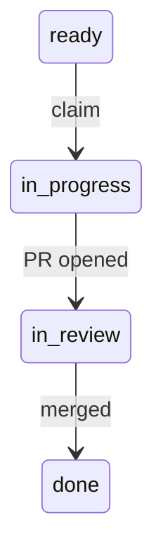

# show-me

Humans scan pictures faster than they read paragraphs. Prose is the fallback, not the default.

## Rules

1. **Fewest words that carry the point.** Cut, then cut again.
2. **No preamble, recap, hedging or drama.** No "Great question", no "Let me…", no restating the
   ask, no "this is the critical insight". Start with the answer.
3. **Structure → visual.** If it has rows, steps, levels, branches or a before/after, draw it.
4. **One visual per idea.** Don't follow a table with a paragraph that says the same thing.
5. **Prose only for the why** — one or two sentences a visual can't carry.
6. **Terse is not cryptic.** Plain words, full sentences, jargon explained or cut. Short and
   clear beats short and puzzling.

## Pick the format

| You are explaining… | Use |
|---|---|
| options, comparisons, results, status | table |
| files changed, layout, ownership | tree |
| control flow, who calls whom | call stack |
| states, sequences, pipelines | mermaid |
| what changed | diff |
| an algorithm | pseudocode |
| data shape, an interface | type signature |
| UI | ASCII or HTML mockup |

### Table

| Check | Before | After |
|---|---|---|
| lint | 4 files | all tracked `.mjs` |

### Tree

```
.flow/bin/
├── pick-task.mjs      chooses next ready task
└── flow-state.mjs     reconciles store with PRs
```

### Call stack

```
flow-open-pr.yml
└─ decideOpenPr(task, branch)
   ├─ parseTaskId(branch)
   └─ gh pr create   ← only if none open
```

### Mermaid



### Diff

```diff
- if (status === "in_progress") check(task)
+ if (status === "done" || task.id === ownId) check(task)
```

### Pseudocode

```
for task in store:
  if task.done or task.id == own: require fragment
```

### Type signature

```ts
type Task = { id: string; status: Status; touches: string[] }
```

## PR description

In this order, nothing else:

1. **TL;DR** — one line.
2. **The change, shown** — one visual (diff, tree, table or mermaid).
3. **Captures** — screenshots and, for motion, a recording; or one `Not captured:` line. See
   `## Captures`.
4. **Criteria** — checklist, each ticked with its proving test.
5. **To-dos for the human** — numbered; omit if none.

## Captures

Lets the reviewer judge a visible change by looking, without checking out the branch.

| | |
|---|---|
| **When** | The diff changes something a person sees or interacts with (UI, rendered page, email, generated visual) **and** the session can run it. Not for backend, infra, docs or tooling-only diffs. |
| **What** | The fewest frames that show the change: the changed state at each layout that differs (typically desktop and mobile); before/after when an existing screen changed; a recording (≤ 30 s, `.webm` or `.gif`) only for motion or a multi-step interaction. |
| **Data** | Synthetic data only. Never a real user's data, a credential, a token or a production screen. |
| **Tooling** | Whatever headless browser the environment already has (Playwright with a preinstalled Chromium is typical). Never add it to the repo's dependencies to take a capture. |

**Where.** Captures never go on the feature branch: they would trip `touches-guard` and land
binaries on `main`. Push them to an orphan branch named `captures/<task-id>` (never a `flow/…`
name, which the automation reads as a task branch), then link by that commit's SHA, so a later
push cannot change what the reviewer saw:

```sh
git switch --orphan captures/<task-id>      # empty tree, no history
cp <files> . && git add <files> && git commit -m "captures: <task-id>"
git push origin captures/<task-id>
git rev-parse HEAD                          # <sha> for the links
git switch -                                # back to the feature branch
```

```markdown

[Recording: scroll (12 s)](https://github.com/<owner>/<repo>/blob/<sha>/scroll.webm)
```

Use the `github.com/…/blob/<sha>/…?raw=true` form for inline images. It is GitHub's documented
form for images in pull requests, and it renders in a **private** repo for any viewer with read
access; a `raw.githubusercontent.com` link does not render there without a token.

**When not possible**, the section still appears, as one line, so a stated skip is never confused
with a forgotten one:

```markdown
Not captured: <reason>      e.g. no visible change · no runnable preview · no browser in the environment
```

## Anti-patterns

Too much:

- Wall of text with a TL;DR bolted on the end.
- A TL;DR on a reply short enough to be its own summary (under ~15 lines).
- Dramatic framing, restating the question, recapping what was just shown.
- Headers over one-line sections; bullet lists that are really a table.
- Explaining a diff in words next to the diff.

Too little:

- Dropped articles and verbs ("fixed, pushed, PR up").
- Unexplained jargon, task ids or internal names the reader hasn't seen.
- Arrow chains (`a → b → c`) standing in for a sentence that explains why.
